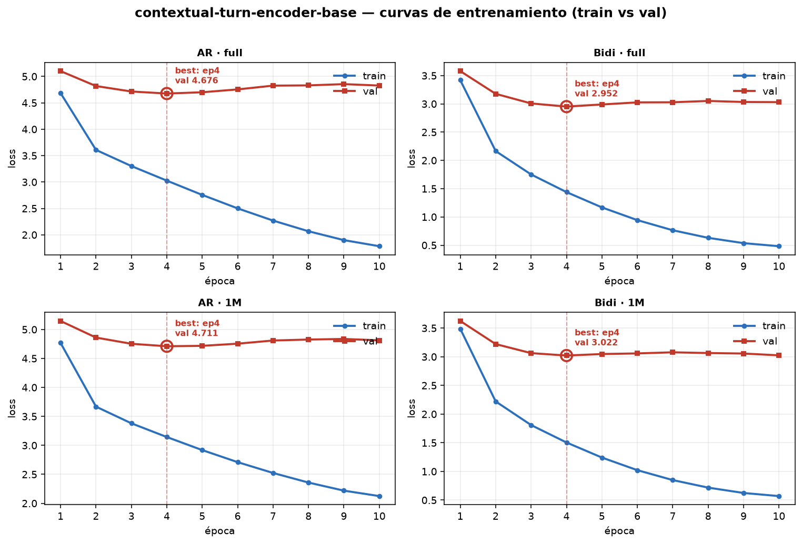
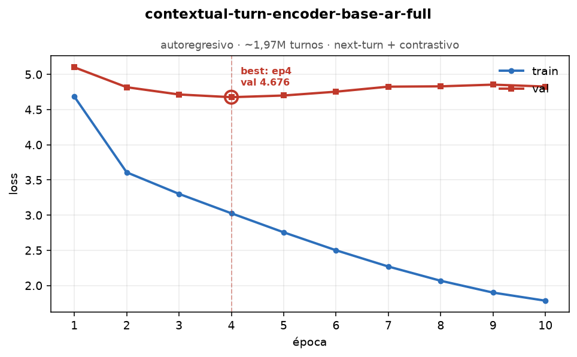
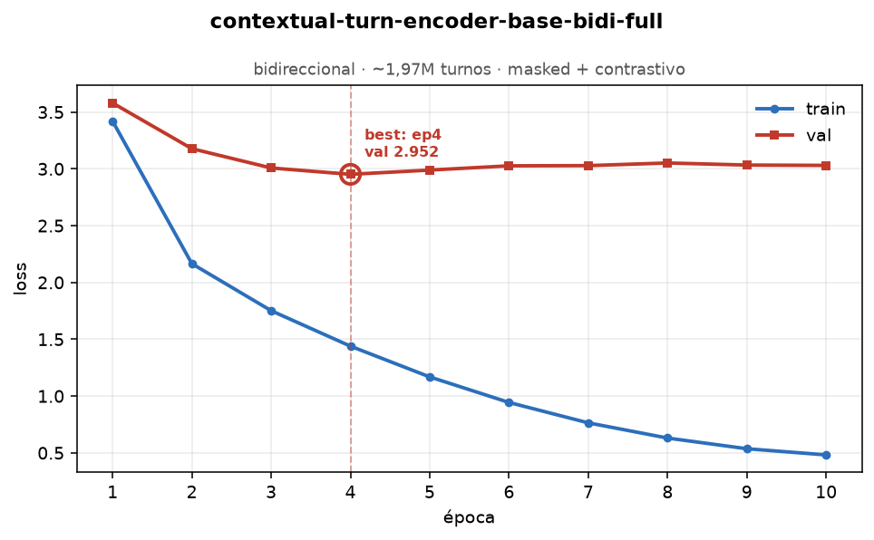
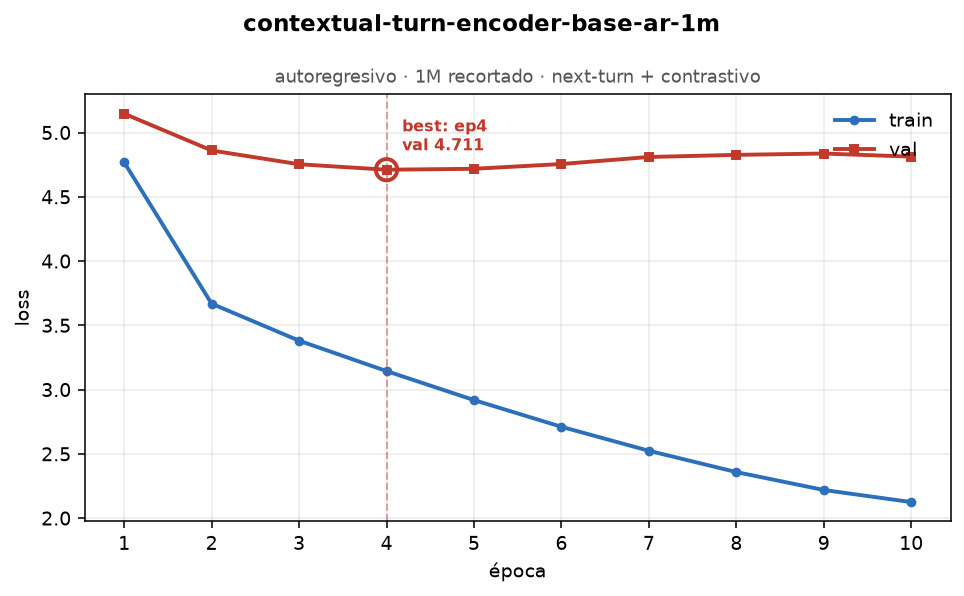
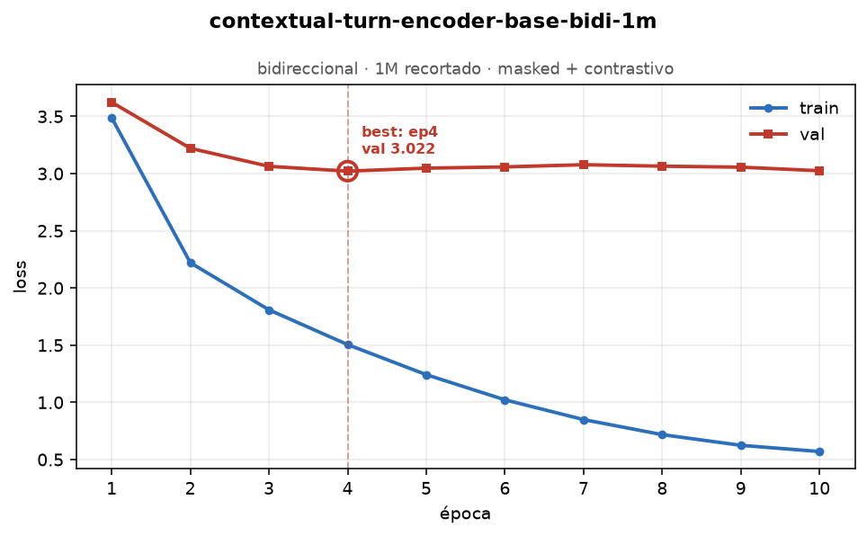

# contextual-turn-encoder-base (model card)

> **Estado: interno / en validación.** Nombre *placeholder* (`contextual-turn-encoder-base`); le
> pondremos uno "pro" cuando esté validado. **No** publicado en Hugging Face todavía.

Encoder **contextual de turnos** (f2): toma una secuencia de embeddings base de turno `e_t` y
produce un embedding contextual por turno `h_t` (un Transformer "sobre turnos", no sobre tokens).
Es un modelo **nuevo y propio**; **Dialog2Flow es solo el linaje de datos**, no este modelo.

## Datos y linaje (apples-to-apples)
- **Dataset:** [`sergioburdisso/dialog2flow-dataset`](https://huggingface.co/datasets/sergioburdisso/dialog2flow-dataset)
  (corpus unificado de 20 datasets TOD, ~3,4M turnos / ~369k diálogos según la ficha).
- **Corpus efectivo del modelo `full`:** **1.974.814 turnos / 196.365 diálogos (19/20 configs)**.
  Se **excluyó `SimJointGEN`** por un error de carga upstream (`DatasetGenerationError`,
  persistente con `force_redownload`). No afecta la comparación: `SimJointGEN` es data **sintética**
  y la **colección del benchmark (1M) cortaba en SGD, antes de SimJointGEN**, así que el conjunto de
  evaluación nunca lo contuvo.
- **Encoder base f1 (fijo):** [`sergioburdisso/dialog2flow-joint-bert-base`](https://huggingface.co/sergioburdisso/dialog2flow-joint-bert-base)
  (768-d) — el **mismo** que usan las baselines ANN (Static / Dynamic / EMA), condición dura para
  que la comparación sea justa.

## Variantes
Modo de atención × escala de corpus:

| Checkpoint | Modo | Corpus | Para qué |
|---|---|---|---|
| `contextual-turn-encoder-base-ar-full`   | autoregresivo | full (~1,97M, 19/20) | **headline** del benchmark (causal, análogo aprendido de Dynamic/EMA) |
| `contextual-turn-encoder-base-bidi-full` | bidireccional | full (~1,97M, 19/20) | techo full-context / inducción de estructura |
| `contextual-turn-encoder-base-ar-1m`     | autoregresivo | 1M (recortado) | ablación |
| `contextual-turn-encoder-base-bidi-1m`   | bidireccional | 1M (recortado) | ablación |

- **AR (causal):** `h_t` depende solo del pasado → memoria conversacional *online*; objetivos:
  `next_turn_prediction` + **contrastivo** (`embedding_retrieval`, **co-primario** — el downstream
  es retrieval).
- **Bidi (full-context):** `h_t` ve todo el diálogo → representación offline más rica; objetivos:
  `masked_reconstruction` + **contrastivo** (co-primario).
- **Residual-to-base** (`output_residual`): `h_t = LayerNorm(e_t + Δ)` → ancla `h_t` cerca de `e_t`.
  Arregla la deriva ortogonal vista en los diagnósticos (`cos(e_t, h_t) ≈ 0.04`) y vuelve al
  Contextual el **análogo aprendido del acumulativo** (mismo patrón `LayerNorm(· + e_t)`).
- Arquitectura: 768-d salida, `num_heads=8`, `max_turns=64`, speaker embeddings on; `num_layers=6`
  para los modelos full, `4` para los 1M. Detalle en [`config.yaml`](config.yaml).

## Held-out (evaluación inductiva limpia)
Para no contaminar el benchmark ANN, se **excluyen del entrenamiento** los diálogos cuyos turnos
son *queries* del benchmark. [`heldout.py`](heldout.py) reproduce exactamente (semilla **42**) los
splits de los notebooks ANN — `benchmark` (`train_test_split test_size=10000`, = `RandomState(42)
.permutation(N)[:10000]`) y `llm` (`default_rng(42).choice(N, 10000)`) — y excluye la **unión** de
los `dialogue_id` correspondientes.

## Cómo se entrena (reproducible)
1. **[`01_generate_base_embeddings_colab.ipynb`](01_generate_base_embeddings_colab.ipynb)** — en
   **Colab/GPU**: baja el corpus completo de D2F, genera las bases `e_t` con
   `dialog2flow-joint-bert-base`, con **checkpoint cada ~500k turnos en borde de diálogo** y
   **resumible**. Salida: `base_embeddings.npy` (memmap) + `dialogs-full.pkl` + `ids.npy`.
2. **[`02_train_contextual_m2.ipynb`](02_train_contextual_m2.ipynb)** — en el **M2/MPS**: entrena
   AR y Bidi leyendo las bases vía **memmap** (`DialogueDataset(lazy=True)`; no entran en RAM),
   excluyendo el held-out. Guarda con `save_pretrained` (config.json + model.safetensors + log).
3. **[`03_train_contextual_v2_m2.ipynb`](03_train_contextual_v2_m2.ipynb)** — **gemela del v2**
   (BERT-fiel): idéntica a la 02 pero con `build_model(arch="v2")`. Para la **comparación controlada
   v1 ↔ v2** (mismos datos/objetivo, solo cambia la arquitectura). Ver
   [`docs/model/v2.md`](../../docs/model/v2.md) y `conversational-ann/results/v1_vs_v2_results.md`.

## Curvas de entrenamiento

Cada variante se entrenó **10 épocas** (`batch=128`, AdamW `lr=2e-4`, `weight_decay=0.01`,
warmup 5%, `dropout=0.1`, contrastivo co-primario y residual-to-base; detalle en
[`config.yaml`](config.yaml)). El loss es el **compuesto del modo** (AR: `next_turn` +
contrastivo · Bidi: `masked` + contrastivo).



**Cómo leerlas:**
- **Las 4 convergen por validación en la época 4** y a partir de ahí *overfittean* (el
  train sigue cayendo, el val se aplana y repunta). El checkpoint que se distribuye es el
  **best-by-val (ep4)**, guardado en `…/<variant>/best/` — **no** la última época.
  → En la práctica, **5 épocas alcanzan**; las 10 fueron de más.
- **`full` generaliza un poco mejor que `1m`** (AR: val 4.676 vs 4.711 · Bidi: 2.952 vs
  3.022): más datos ayudan, poco y como se espera.
- ⚠️ **Los loss NO son comparables entre modos.** AR optimiza *next-turn* (el futuro es
  inherentemente impredecible → piso alto ~4.7); Bidi optimiza *masked reconstruction* (ve
  pasado **y** futuro → tarea más fácil → val ~3.0, train <0.5). Que `2.95 < 4.68` **no**
  significa "Bidi es mejor": es otra tarea. La comparación válida entre modos es
  **downstream** (ANN/MSS), no estas curvas.
- El val interno es un **proxy** del objetivo auto-supervisado, no el veredicto de calidad
  del embedding — eso lo dan los diagnósticos de contextualidad + la evaluación downstream
  (`packages/conversational-ann`).

<details>
<summary><b>Curvas individuales por variante</b></summary>

| | |
|:---:|:---:|
|  |  |
|  |  |

</details>

Regenerar: **`python plot_training_curves.py`** (lee `logs/*.jsonl`, escribe `figures/*.png`;
requiere `matplotlib`). Los `logs/` son los `trainlog.jsonl` de cada corrida, versionados como
fuente de las figuras.

## Cómo cargar el modelo
Los pesos **no van a git** (`models/` está gitignored): se distribuyen como **asset de un GitHub
Release** del repo `doctorado-unsl` (interno). 

```bash
# 1) bajar el checkpoint (ejemplo)
gh release download cte-base-v0 -p "cte-base-ar-full.tar.gz"
mkdir -p packages/contextual-turn-embeddings/models
tar xzf cte-base-ar-full.tar.gz -C packages/contextual-turn-embeddings/models
```
```python
# 2) cargar y codificar (h_t)
from contextual_turn_embeddings import ContextualTurnModel, encode_dialogues
model = ContextualTurnModel.from_pretrained(
    "packages/contextual-turn-embeddings/models/contextual-turn-encoder-base-ar-full")
matrix, metadata = encode_dialogues(model, df, embeddings=base_embeddings)  # base_embeddings = e_t (D2F encoder)
```
> Importante: para codificar hay que pasar **bases del mismo encoder** (`dialog2flow-joint-bert-base`,
> 768-d). El encoder f1 no se serializa con f2.

## Limitaciones / estado
- Modelo **sin validar** todavía (la evaluación ANN/MSS vive en `packages/conversational-ann`,
  etapa posterior). No publicar como "el modelo" hasta tener números.
- El número *transductivo* (entrenar con datos que incluyen la colección, evaluar sobre ella) es el
  principal; el *inductivo* (sobre el held-out) es el chequeo de robustez.
