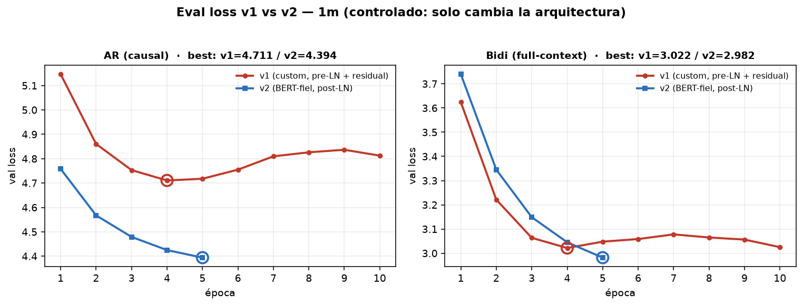

# v1 ↔ v2 — comparación controlada (1m)

**Experimento control** (2026-06-17): mismo `f1` (D2F), corpus `1m`, held-out (seed 42), objetivo
(next-turn/masked + contrastivo co-primario), hiperparámetros y split. **Lo único que cambia es la
arquitectura:** v1 (custom, pre-LN + residual `h=LayerNorm(e_t+Δ)`) vs v2 (BERT-fiel, post-LN, sin
residual). Objetivo: *aislar el efecto de la arquitectura*.

> Nota de fairness: v1 corrió 10 épocas (best ep4, después overfit); **v2 corrió solo 5 y seguía
> bajando** → los números de v2 son, si acaso, una **cota conservadora**.

## 1. Curva de eval-loss

| época | v1-AR | v2-AR | v1-Bidi | v2-Bidi |
|---|---|---|---|---|
| 1 | 5.147 | 4.758 | 3.624 | 3.740 |
| 2 | 4.860 | 4.567 | 3.221 | 3.345 |
| 3 | 4.753 | 4.479 | 3.064 | 3.149 |
| 4 | 4.711 | 4.425 | 3.022 | 3.045 |
| 5 | 4.718 ↑ | 4.394 ↓ | 3.048 ↑ | 2.982 ↓ |
| **best** | **4.711** (ep4) | **4.394** (ep5, sigue ↓) | **3.022** (ep4) | **2.982** (ep5, sigue ↓) |

**Lectura:** **v2 gana claro la curva** — val más baja y **sin overfittear** en 5 épocas, mientras
v1 ya se aplana/overfittea en ep4 (`↑`). Tiene sentido: post-LN + **sin el residual** que ancla a
`e_t` → v2 queda más libre para minimizar el objetivo. (Esto atiende justo la queja de "el eval loss
no baja": **es la arquitectura**.)

## 2. Act-match P@k (estructura funcional del turno)

| representación | P@1 | P@10 |
|---|---|---|
| **Contextual-Bidi (v1)** | 0.982 | **0.969** |
| **Contextual-AR (v1)** | 0.979 | 0.965 |
| **Contextual-AR (v2)** | **0.980** | 0.962 |
| **Contextual-Bidi (v2)** | 0.978 | 0.958 |
| Static | 0.963 | 0.945 |
| EMA(α0.6) | 0.963 | 0.882 |
| Acumulativo | 0.940 | 0.786 |
| Random (piso) | 0.322 | 0.329 |

**Lectura:** **v2 ≈ v1**, marginalmente *abajo* en P@10 (sobre todo Bidi: 0.958 vs 0.969). Ambos
**≫ baselines**. El v1 con residual preserva un toque mejor la señal de acto.

## 3. Lo importante — la **disociación**

> **v2 baja MÁS el eval loss pero NO mejora act-match (lo empeora un poco).**

Es la confirmación limpia de algo que veníamos diciendo:
- El **eval loss es un proxy, no el veredicto**: una arquitectura con loss más bajo **no** dio mejor
  downstream.
- El **residual de v1** (`h=LayerNorm(e_t+Δ)`) es un **regularizador**: *cuesta* eval-loss pero
  *ayuda* act-match (ancla `h_t` al `e_t` rico en acto). v2, sin él, gana loss y pierde un poco de
  estructura-de-acto.

## 4. Conclusión

- La **arquitectura SÍ afecta la dinámica de entrenamiento** (v2 = curva mucho más sana), **pero NO
  el downstream act-match** (≈ v1).
- Refuerza el claim de la línea: **el lever no es la arquitectura, es el objetivo** (Fase 2 / codebook).
- Para la tesis: *"probamos un BERT estándar y fiel; mejora la curva pero no cambia la conclusión
  downstream → la palanca está en el objetivo, no en la arquitectura."*

## Pendiente

- **MSS@10 (situación) para v2** — necesita el juez LLM (key + costo). Es la métrica que *de verdad*
  requiere contexto; ahí vive la pregunta real (¿alguno le gana a EMA?).
- **AR como decoder probabilístico** (softmax sobre codebook + cross-entropy) — Fase 2.

## Reproducibilidad

- Entrenamiento: [`train_arch_1m.py`](../../contextual-turn-embeddings/training/contextual-turn-encoder-base/train_arch_1m.py) `--arch v2 --modes ar bidi` (orquestado por `run_v2_experiment.sh`).
- Eval: [`eval_prelim.py`](../scripts/eval_prelim.py) (corpus 1m, `encode` + `metric`) — ahora maneja v1 **y** v2.
- Curvas: `plot_v1_vs_v2.py`.
