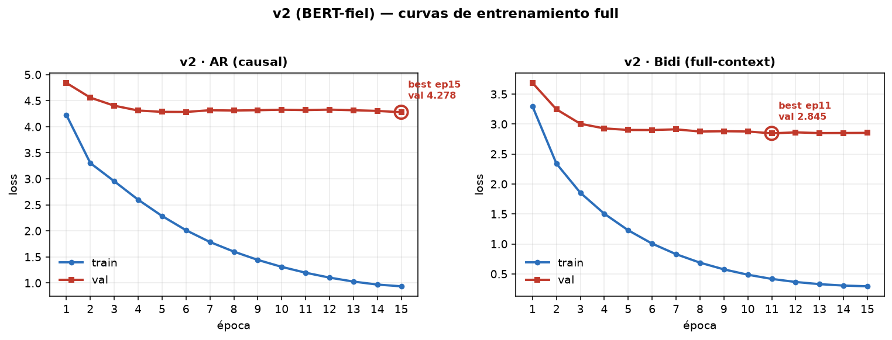
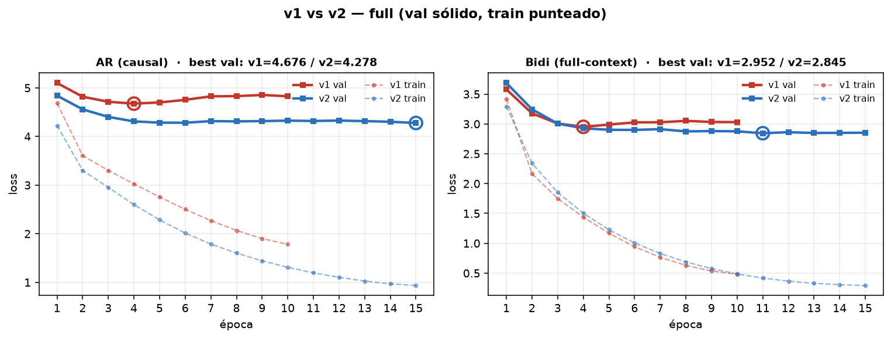

# v1 ↔ v2 — comparación de entrenamiento (full)

**(2026-06-19)** Comparación **controlada** sobre el corpus **full** (~1.97M turnos): mismo `f1`, mismo
held-out (semilla 42), mismo objetivo, **mismo optimizador** (`lr=2e-4`), misma data — **lo único que
cambia es la arquitectura** (v1 custom pre-LN + residual ↔ v2 BERT-fiel post-LN). v1 = 10 épocas, v2 = 15.

> (La comparación previa en `1m` queda superada por esta, sobre todos los datos.)

## Curvas

**v2 (train + val):**

**v1 vs v2 (val sólido, train punteado):**

## Eval loss (best-by-val)

| modo | v1 best | v2 best | Δ |
|---|---|---|---|
| **AR** | 4.676 (ep4) | **4.278** (ep15) | **v2 −0.40** |
| **Bidi** | 2.952 (ep4) | **2.845** (ep11) | **v2 −0.107** |

## Lectura

- **v2 gana el eval loss en los dos modos** y, sobre todo, **overfittea muchísimo menos**: el val del
  **v1 sube** después de ep4 (mejor en ep4, después se degrada); el del **v2 se queda plano** en su
  mínimo. La arquitectura BERT-fiel (post-LN, **sin el residual** que ancla a `e_t`) entrena más sano.
- **Convergencia:** v2-AR ~ep6, v2-Bidi ~ep11 → **los dos convergen dentro de 15** ⇒ **30 épocas eran
  innecesarias** (el LR-decay las estira pero no agrega nada).
- **train vs val:** v2 ajusta el train **más fuerte** (train más bajo) **y** generaliza mejor (val más
  bajo). El residual del v1 le *subía* el train (lo restringía) sin bajarle el val.

## Conclusión

Sobre **todos los datos**, la arquitectura **BERT-fiel (v2) le gana claramente al custom (v1)** en eval
loss, en los dos modos y con mucho menos overfitting. Es el resultado limpio y citable del control.

> **Caveat de siempre:** el eval loss es un **proxy**. El veredicto **downstream** (act-match / MSS@10)
> para v2-**full** está **pendiente** — encodear la colección 1M con el checkpoint v2-full y correr
> `eval_prelim`. Y el salto real de calidad sigue siendo la **Fase 2 (objetivo/codebook)**, no la
> arquitectura.

## Reproducibilidad

- **Entrenamiento:** [`03_train_contextual_v2_m2.ipynb`](../../contextual-turn-embeddings/training/contextual-turn-encoder-base/03_train_contextual_v2_m2.ipynb) (`CORPUS="full"`).
- **Curvas:** [`plot_full_results.py`](../../contextual-turn-embeddings/training/contextual-turn-encoder-base/plot_full_results.py).
- **Act-match v1↔v2 (1m):** `eval_prelim.py` (`--phase encode/metric`).
